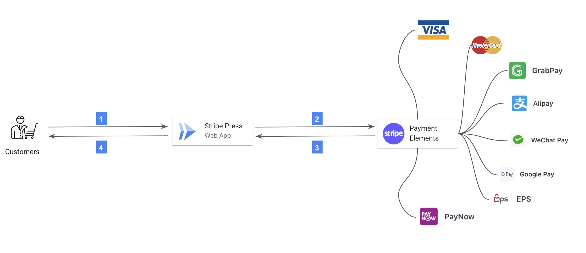

# Take home project

This project is a minimal e-commerce web app that allows customers to purchase a book and complete payment using Stripe Payment Element APIs.

The repository demonstrates how to integrate Stripe’s PaymentIntent lifecycle, enabling robust handling of complex payment flows and providing fine-grained control over the payment process.


## Application

Using [poetry](https://python-poetry.org/docs/#installation) to manage python environment and dependencies. 
 

To get started, clone the repository and run pip3 to install dependencies:

```shell
git clone https://github.com/cc4i/sa-takehome-project-python.git && cd sa-takehome-project-python
```

You can modify the Python version in [pyproject.toml](./pyproject.toml) accordingly, and then update the lock file and dependencies:

```shell
poetry lock
```

Then install and activate the environment:

```shell
poetry install
poetry shell
```

Rename `sample.env` to `.env` and populate it with your Stripe account's API keys.

Then run the application locally:

```
poetry run flask run
```

Navigate to [http://localhost:5000](http://localhost:5000) to view the index page.


## Journey

### Problems
The assignment was from Su's email.

- Your output should be a simple program that allows the user to take a few actions:

    - Select a book to purchase.
    - Checkout and purchase the item using Stripe Elements.
    - Display a confirmation of purchase to the user with the total amount of the charge and the Stripe Payment Intent ID (beginning with pi_).

- When you're done, push the project to Github or place it in a zip file and return it along with a document (README.md, a Google doc, etc.) containing the following:

    - How to build, configure, and run your application.
    - How the solution works, which Stripe APIs it uses, and how your application is architected.
    - How you approached this problem, which docs you used to complete the project, and what challenges you encountered.
    - How you might extend this if you were building a more robust instance of the same application.

### Approach

#### 1. Researching and understanding the core concepts

I began by researching and understanding the core concepts and architecture of [Stripe's payment platform](https://stripe.com/en-sg/payments). This included:

- Stripe Payments: I gained a foundational understanding of how Stripe processes online payments, including the flow of funds, security considerations, and the roles of various [Stripe objects](https://docs.stripe.com/payments-api/tour#core-concepts), especially Payment objects.
- [Stripe Payment Elements](https://docs.stripe.com/payments/payment-element): I studied how Payment Elements provide a customizable, secure, and PCI-compliant UI component for collecting payment details and how they can be integrated into a custom checkout flow.
- [Payment Intents API](https://docs.stripe.com/api/payment_intents): Learned how the Payment Intents API orchestrates the payment process, manages state transitions (e.g., requires_action, succeeded, failed) and supports dynamic [3D Secure](https://docs.stripe.com/payments/3d-secure).
- [Checkout Sessions API](https://docs.stripe.com/api/checkout/sessions): Explored the differences between building a custom checkout with Payment Elements versus using Stripe Checkout Sessions, which offer a pre-built, Stripe-hosted checkout page for rapid integration.
- [Stripe Checkout](https://docs.stripe.com/payments/checkout): Compared the use cases and trade-offs between Stripe Checkout and custom Payment Element integrations, including flexibility, user experience, and compliance requirements.

This foundational knowledge enabled me to make informed architectural decisions and select the most appropriate Stripe APIs and integration patterns for the project.

#### 2. Gained hands-on experience with Stripe's sandbox

I gained hands-on experience with [Stripe's sandbox environment](https://docs.stripe.com/sandboxes) to safely experiment with payment flows, error scenarios, and webhook events without risking real funds. This included:

- Creating and using test API keys to simulate real-world payment scenarios.
- Utilizing Stripe's test card numbers and payment methods to trigger various payment outcomes (success, failure, authentication required, etc.).
- Exploring the Stripe Dashboard's test mode to monitor PaymentIntent creation, state transitions, and webhook deliveries in real-time.
- I studied a variety of open-source sample projects and code snippets from GitHub, focusing on both backend (Python/Flask) and frontend (JavaScript/Stripe Elements) integrations. This helped me understand best practices, common pitfalls, and efficient implementation patterns.
- I supplemented my learning by watching [Payment Element using Python](https://www.youtube.com/watch?v=tCSbCk5j3Tk) and tutorial videos on YouTube. These resources provided practical demonstrations of Stripe integration, troubleshooting tips, and insights into real-world use cases, which accelerated my understanding and implementation process.

#### 3. Analyse the baseline repo and planning
I cloned the [repository](https://github.com/marko-stripe/sa-takehome-project-python), resolved initial setup issues to ensure the app runs locally, and planned the integration of Stripe using the Payment Intents API.

#### 4. Technical design

##### High level architecture

The application integrates Stripe Payment Elements, which are securely embedded in the website via an iframe. These elements are dynamically configured to support a wide range of payment methods. Below is a system diagram illustrating the overall architecture:



1 & 2 - Customers interact with the online website throughout their shopping experience.
3 & 4 - The web application manages the payment process behind the scenes, powered by Stripe.


###### High level workflow

Here's a breakdown of the workflow happening behind the scenes:


#### 5. Tasks in action 
- Implemented a dedicated checkout page, integrating Stripe Payment Elements to securely collect payment details from users. I developed supporting JavaScript to handle form submission, client-side validation, and communication with the backend to create PaymentIntents.
- Created a confirmation (complete) page that displays the outcome of the payment, including the total amount charged and the Stripe Payment Intent ID. I ensured the page dynamically retrieves and presents relevant transaction details to the user.
- Conducted thorough testing of the payment flow, simulating various scenarios such as successful payments, failed transactions, and required authentication steps. I optimized both frontend and backend code for reliability, user experience, and error handling.
- Refactored and cleaned up the codebase, organizing scripts, templates, and static assets for maintainability. I improved code readability and ensured consistent styling across the application.
- Authored documentation outlining setup instructions, configuration steps, and usage guidelines. I prepared the project for distribution by packaging all necessary files and dependencies, ensuring ease of deployment and reproducibility.

### Challenges

- Initially confused by Stripe Payment Elements vs. Stripe Checkout


## Reflection

- Extend payment functionality to support features like multiple currencies, payment cancellation, and automated invoice emailing.
- Enhance security by leveraging dedicated solutions such as Secret Manager or Vault for managing sensitive credentials.
- Increase the observability of the integration by:
  - Implementing client-side logging to track Payment Element lifecycle events.
  - Adding comprehensive server-side logging for each step of the payment process, including webhook event handling.
  - Monitoring key metrics such as API error rates, latency, and client-side errors.
- Design the system to operate reliably at scale.
- Strengthen overall security posture.
- Ensure the application is easy to deploy on cloud platforms.
